# Awesome Electronic Shelf Labels (ESL) Management 🏷️⚡

  

  
  
  
  
  

## 🚀 Top Electronic Shelf Labels (ESL) & Retail Digital Signage Ecosystem

**Curated List of Enterprise SaaS Platforms, Commercial Products & Open-Source GitHub Projects** 🛍️💻  
*Focused on Electronic Shelf Label Systems, Price Tag Management, Smart Retail Hardware, E-Paper Displays & Wireless Label Control Protocols (RF, BLE, IR).*

> **Last updated: August 2026** 📅

---

### 💡 Overview & SEO Guide

Welcome to the definitive awesome list for **Electronic Shelf Label (ESL) Management Software**, **Dynamic Pricing Systems**, and **DIY E-Paper IoT Hardware**. Electronic Shelf Label systems allow retail stores, supermarkets, and warehouses to wirelessly update product prices, active promotions, inventory stock levels, and product metadata in real time on e-paper or LCD displays—eliminating manual paper labeling and pricing errors.

Whether you are looking for **enterprise cloud platforms** for multi-store retail chain deployments or **open-source ESP32/BLE firmware** to build custom self-hosted shelf tags, this list provides comprehensive technical details, pricing, scale metrics, and repository star counts.

---

## 📑 Table of Contents

- [☁️ SaaS & Commercial Hosted Platforms](#-saas--commercial-hosted-platforms)
- [🔓 Open-Source GitHub Projects](#-open-source-github-projects)
- [🛠️ DIY Protocols & Home Automation Integrations](#-diy-protocols--home-automation-integrations)
- [🤝 How to Contribute](#-how-to-contribute)
- [⚖️ Disclaimer](#-disclaimer)
- [⭐ Star History](#-star-history)

---

## ☁️ SaaS & Commercial Hosted Platforms

This table lists enterprise-grade Electronic Shelf Label (ESL) SaaS management platforms and commercial solutions, sorted descending by **Company Scale (Annual Revenue / Market Valuation)** 📊:

| Product / Platform | Company Scale (Revenue / Valuation) 📈 | Description 📝 | Pricing 💰 | Free Tier / Trial Limits ⏳ |
| :--- | :--- | :--- | :--- | :--- |
| **[Solum ESL](https://www.solumesl.com/)** | **~$1.30 Billion** (~1.7 Trillion KRW Annual Revenue) | Global retail IoT leader providing Newton series ESL displays with 7-color LEDs, ultra-fast RF gateways, and AIMS SaaS central label management platform. | Hardware: Newton tags $7–$25/unit; Gateway hardware ~$250–$600; AIMS SaaS software subscription starting ~$400/year per store. | Starter Pack (€1,499 for 50 labels + AP) includes a 60-day free software trial; no permanent free tier. |
| **[E Ink ESL Platform](https://www.eink.com/)** | **~$1.15 Billion** (36.12 Billion NTD Annual Revenue) | World's premier e-paper display technology provider powering commercial electronic price tags, display modules, and partner cloud ecosystems. | Component display modules $4–$15/unit; Ecosystem SaaS integrations starting ~$300/year per store location. | No free tier; developer kits include 30-day software access for display evaluation. |
| **[SES-imagotag / VusionCloud](https://www.ses-imagotag.com/)** | **~$1.10 Billion** (€1.01 Billion Annual Revenue) | Global market leader in electronic shelf labels and retail IoT cloud platforms, offering large-scale retail deployments, real-time pricing, and VusionGroup ecosystem software. | Hardware: $5–$20/label (basic e-ink) up to $50+/label; VusionCloud SaaS starting ~$500/year platform fee + maintenance. | No free tier; standard 30-day guided enterprise demo/PoC available upon request. |
| **[Hanshow](https://www.hanshow.com/)** | **~$600 Million** (4.21 Billion CNY Annual Revenue) | Major international ESL manufacturer offering multi-protocol electronic labels, solar-powered tags, and unified retail digital signage management software. | Hardware: $6–$22/label depending on display size; Cloud/SaaS software subscription starting ~$350/year base tier. | No free tier; 14-day to 30-day proof-of-concept (PoC) software trial available upon sales request. |
| **[Pricer Plaza](https://www.pricer.com/)** | **~$220 Million** (~218.6 Million USD Annual Revenue) | Premium optical (IR) and radio-based ESL platform with Pricer Plaza centralized SaaS management for dynamic pricing and real-time store operations. | Hardware: SmartTAG labels $8–$30/unit; Optical IR Transceivers ~$300–$500/unit; Pricer Plaza SaaS starting ~$500/year platform license. | No free tier; 30-day pilot/demo program available for enterprise testing. |
| **[Zkong Cloud](https://www.zkong.com/)** | **~$50 Million** (Enterprise Growth Phase) | Cloud-native smart retail ESL platform supporting public SaaS, private cloud, and local server deployments with dynamic drag-and-drop template editing. | Hardware: $5–$18/label; Cloud SaaS management subscription starting ~$30/month ($360/year) for basic store management. | 30-day full feature SaaS demo account; no permanent free tier. |
| **[Displaydata](https://www.displaydata.com/)** | **~$40 Million** (£10M–£50M Annual Revenue) | Enterprise electronic shelf label platform featuring high-contrast e-paper displays and Dynamic Central Communicator management software. | Hardware: $6–$25/label; Gateway hardware ~$400; Software license starting ~$450/year per store location. | No free tier; 30-day proof-of-concept evaluation program available upon request. |
| **[JRTech](https://www.jrtech.com/)** | **~$25 Million** (North American Systems Integrator) | Leading North American retail technology provider specializing in Pricer IR electronic shelf label infrastructure, installation, and POS integrations. | Turnkey bundled deployment starting ~$15/label (includes hardware + gateway + Pricer software tier). | No free tier; 30-day on-site pilot program available for qualified retail stores. |
| **[Altierre](https://www.altierre.com/)** | **~$15 Million** (Private Enterprise Retail Technology) | Ultra-low power long-range wireless ESL and digital sign platform engineered for large-scale grocery and retail chain deployments. | Enterprise package pricing starting ~$12–$25 per endpoint (hardware + gateway + central wireless management software license). | No free tier; 30-day pilot deployment available for chain retail evaluation. |

---

## 🔓 Open-Source GitHub Projects

This section lists open-source firmware, DIY management platforms, and protocol reverse-engineering tools for Electronic Shelf Labels.

All projects are sorted descending by **GitHub Star Count** ⭐ and feature white social star badges linking directly to each repository's stargazers page:

- **[OpenEPaperLink](https://github.com/OpenEPaperLink/OpenEPaperLink)**   
  The leading open-source firmware and protocol ecosystem for electronic shelf labels. Uses ESP32-based access points and 802.15.4 radio to communicate with low-power e-paper tags. Features Home Assistant integration, image generator services, and custom web management.

- **[ATC_TLSR_Paper](https://github.com/atc1441/ATC_TLSR_Paper)**   
  Custom open-source BLE (Bluetooth Low Energy) firmware created by Aaron Christophel for Hanshow Telink TLSR8359-based e-paper electronic price tags, allowing wireless image updates over WebBluetooth or Python.

- **[PrecIR](https://github.com/furrtek/PrecIR)**   
  Open-source toolkit and hardware documentation for reverse-engineering and communicating with infrared-based electronic shelf labels (such as legacy Pricer tags), including image transfer utilities and experimental clients.

- **[OpenEPaperLink Home Assistant Integration](https://github.com/OpenEPaperLink/Home_Assistant_Integration)**   
  Official Home Assistant custom component for OpenEPaperLink. Allows home automation enthusiasts to push sensor data, weather forecast graphics, line charts, and custom text to e-paper ESL tags directly from Home Assistant dashboards.

- **[E-Paper_Pricetags](https://github.com/atc1441/E-Paper_Pricetags)**   
  Comprehensive reverse-engineering repository, pinout guides, teardowns, and custom flashing tools for various commercial e-paper price tag models (Hanshow, Solum, SoluM Newton, Stellar, and Gicisky).

- **[hass-gicisky](https://github.com/eigger/hass-gicisky)**   
  Home Assistant custom component for controlling Gicisky BLE Electronic Shelf Labels directly over Bluetooth Low Energy without needing proprietary gateway hardware.

- **[elink](https://github.com/rbaron/elink)**   
  Daisy-chained open-source ESL display system using Hanshow-compatible e-paper hardware, UART linking, BLE control, and Python/web clients for custom drawing and tag management.

- **[ESP32 ESL System](https://github.com/giobauermeister/esp32-esl-system)**   
  Complete DIY Electronic Shelf Label system built with ESP32-S3 microcontroller boards and e-paper displays, featuring a web management interface, canvas editor, and MQTT broker integration.

- **[Cloud-Label](https://github.com/microlong666/Cloud-Label)**   
  Full-stack Java Spring Boot open-source electronic label management platform providing store management, product inventory sync, device status monitoring, and visual template designing.

- **[Electronic Shelf Label Management System (DIY)](https://github.com/Northstrix/Electronic-Shelf-Label-Management-System)**   
  Open-source (MIT) software and 3D-printable hardware designs for building custom Wi-Fi electronic shelf labels, complete with a desktop management application for item price management.

---

## 🛠️ DIY Protocols & Home Automation Integrations

- **Home Assistant Dashboards & MQTT Bridges**: Connect custom ESP32/ESP8266 or Zigbee e-paper tags to home automation setups to display real-time sensor metrics, room temperatures, calendar events, or price tracker data.
- **Custom E-Paper Drivers (GxEPD2 / Adafruit EPD)**: Arduino and ESP-IDF C++ libraries designed for driving 1.54", 2.13", 2.9", 4.2", and 7.5" e-paper displays used in shelf label hardware.
- **Protocol Analysis & Teardowns**: Community tools for sniffing 802.15.4, 2.4GHz proprietary RF, sub-GHz, BLE, and Infrared communication protocols used by major commercial ESL manufacturers.

---

## 🤝 How to Contribute

Contributions are warmly welcomed! Help keep this ecosystem guide up-to-date by submitting a Pull Request:

1. Fork the repository.
2. Add or update entries in `README.md` following the established table or badge structure.
3. Ensure entries include accurate pricing, company scale metrics, or open-source star count badges.
4. Submit your PR with a concise description!

Check out our curated list of awesome lists at [Awesome-Awesome-Awesome](https://github.com/ishandutta2007/Awesome-Awesome-Awesome)!

---

## ⚖️ Disclaimer

- This repository is a **community-curated index** for informational and educational purposes.
- Enterprise ESL platforms are designed for large retail environments with certified radio hardware, enterprise SLAs, and multi-year battery life optimizations. Open-source solutions are ideal for prototyping, home automation, small business experiments, and research.
- Always comply with local RF spectrum regulations, wireless transmission limits, and intellectual property guidelines when analyzing hardware protocols.

---

##  Star History

<a href="https://www.star-history.com/?repos=ishandutta2007%2FAwesome-Electronic-Shelf-Labels-Management&type=date&legend=bottom-right">
<picture>
<source media="(prefers-color-scheme: dark)" srcset="https://api.star-history.com/chart?repos=ishandutta2007/Awesome-Electronic-Shelf-Labels-Management&type=date&theme=dark&legend=bottom-right" />
<source media="(prefers-color-scheme: light)" srcset="https://api.star-history.com/chart?repos=ishandutta2007/Awesome-Electronic-Shelf-Labels-Management&type=date&legend=bottom-right" />

</picture>
</a>

---

**Made with ❤️ for retailers, IoT developers, makers, and smart hardware enthusiasts.**
